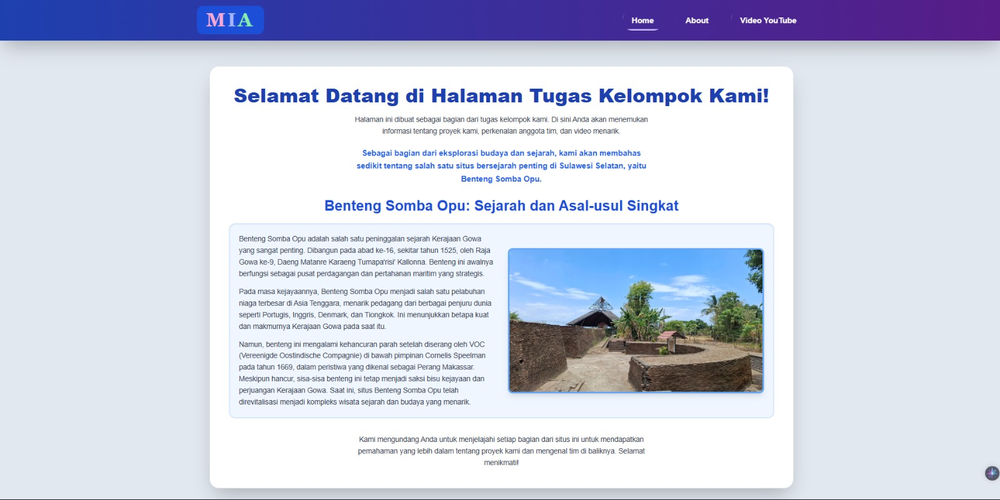
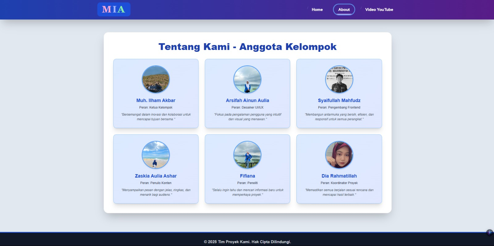
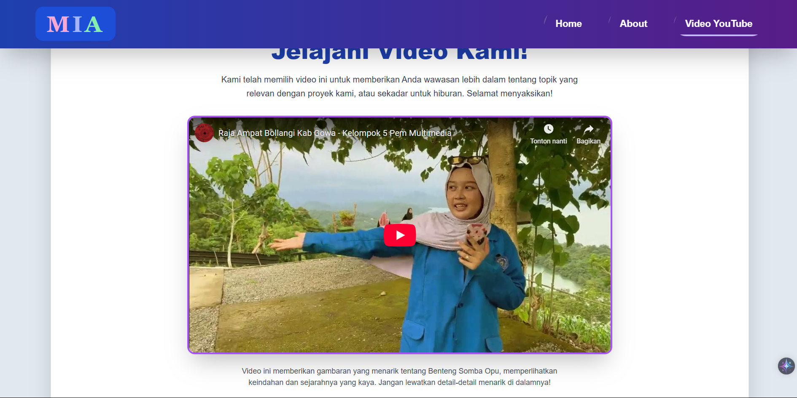

# Tugas Kelompok Kami - Sistem Multimedia

## Deskripsi Proyek

Proyek ini adalah halaman web interaktif yang dibuat sebagai tugas kelompok untuk mata kuliah Sistem Multimedia. Website ini menampilkan informasi tentang tim kami, sejarah Benteng Somba Opu, dan video edukatif terkait.

## Fitur Utama

- **Navigasi Interaktif**: Single Page Application (SPA) dengan transisi smooth
- **Responsive Design**: Tampilan yang optimal di berbagai perangkat
- **Animasi CSS**: Efek hover dan transisi yang menarik
- **Video Integration**: Embedded YouTube video player
- **Modern UI**: Menggunakan Tailwind CSS untuk styling

## Struktur Proyek

```
SISTEM_MULTIMEDIA/
├── index.html          # File utama website
├── foto/              # Folder berisi foto anggota tim
│   ├── dia.png
│   ├── fifi.png
│   ├── ilham.png
│   ├── ipul.png
│   ├── kia.png
│   └── sipa.png
└── README.md          # File dokumentasi ini
```

## Teknologi yang Digunakan

- **HTML5**: Struktur semantik website
- **CSS3**: Styling dengan custom animations dan transitions
- **JavaScript**: Interaktivitas dan navigasi SPA
- **Tailwind CSS**: Framework CSS utility-first
- **YouTube API**: Embedded video player

## Anggota Tim

1. **Muh. Ilham Akbar** - Ketua Kelompok
2. **Arsifah Ainun Aulia** - Desainer UI/UX
3. **Syaifullah Mahfudz** - Pengembang Frontend
4. **Zaskia Aulia Ashar** - Penulis Konten
5. **Fifiana** - Peneliti
6. **Dia Rahmatillah** - Koordinator Proyek

## Konten Website

### 1. Halaman Home

- Sambutan dan pengantar proyek
- Informasi detail tentang Benteng Somba Opu
- Sejarah dan asal-usul Benteng Somba Opu
- Gambar ilustrasi dari Google

### 2. Halaman About

- Profil lengkap anggota tim
- Peran masing-masing anggota
- Foto dan quote inspiratif

### 3. Halaman Video

- Video YouTube tentang Benteng Somba Opu
- Link langsung ke YouTube
- Deskripsi video

## Cara Menjalankan

1. **Clone atau Download** repository ini
2. **Buka folder** SISTEM_MULTIMEDIA
3. **Jalankan dengan Live Server**:
   - Buka file `index.html` di VS Code
   - Klik kanan dan pilih "Open with Live Server"
   - Atau gunakan ekstensi Live Server di VS Code
4. **Alternatif**: Buka file `index.html` langsung di browser

## Fitur Interaktif

- **Smooth Navigation**: Perpindahan halaman tanpa reload
- **Hover Effects**: Animasi pada tombol dan kartu anggota
- **Responsive Grid**: Layout yang menyesuaikan ukuran layar
- **Active State**: Indikator menu yang sedang aktif
- **YouTube Integration**: Video dapat diputar langsung di website

## Styling dan Animasi

- **Gradient Backgrounds**: Warna gradasi yang menarik
- **Box Shadows**: Efek bayangan untuk depth
- **Transform Effects**: Scale dan translate animations
- **Transition Effects**: Smooth animations pada hover
- **Typography**: Font Inter untuk readability

## Browser Compatibility

Website ini kompatibel dengan:

- Chrome (Recommended)
- Firefox
- Safari
- Edge
- Opera

## Troubleshooting Live Server

Jika mengalami masalah dengan Live Server:

1. **Install Live Server Extension**:

   - Buka VS Code
   - Pergi ke Extensions (Ctrl+Shift+X)
   - Cari "Live Server"
   - Install ekstensi oleh Ritwick Dey

2. **Cara Menggunakan**:

   - Buka file `index.html` di VS Code
   - Klik kanan pada file
   - Pilih "Open with Live Server"
   - Website akan terbuka di browser default

3. **Port Issues**:

   - Default port: http://localhost:5500
   - Jika port conflict, Live Server akan otomatis menggunakan port lain

4. **Firewall/Antivirus**:
   - Pastikan tidak ada blocking dari firewall
   - Allow VS Code dan Live Server di antivirus

## Kontribusi

Proyek ini dibuat untuk keperluan akademis. Setiap anggota tim berkontribusi sesuai perannya masing-masing.

## Lisensi

© 2025 Tim Proyek Kami. Hak Cipta Dilindungi.
Didedikasikan untuk inovasi dan kolaborasi dalam bidang pendidikan.

## Kontak

Untuk informasi lebih lanjut atau pertanyaan terkait proyek ini, silakan hubungi anggota tim melalui platform yang tersedia.

---

_Dokumentasi ini dibuat dengan ❤️ oleh Tim Sistem Multimedia_
